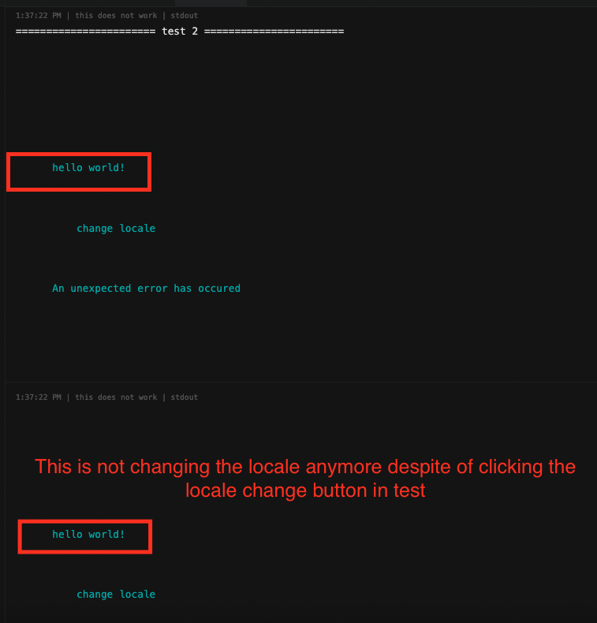

# Setup

```
yarn install
yarn test --ui
```

and open the url of vitest. (when `yarn test --ui` is executed, automatically it should open.)

# How to reproduce

> **PLEASE IGNORE THE TEST STATUS.** the both tests pass but I am not asserting anything
> 

## 1. Click test file on the left, then click the console tab on the top bar


## 2. scroll printed item and compare the print from "This works" test and "This does not work" tests.


The both tests have the exact same code which is clicking the locale change button and printing the result. The first test changes the locale as expected, but the second test stops working.




# npm packages in this project

```
"vue-i18n": "^9.2.2"
"@intlify/unplugin-vue-i18n": "^0.10.0",
"@testing-library/jest-dom": "^5.16.5",
"@testing-library/user-event": "^14.4.3",
"@testing-library/vue": "^7.0.0",
"@vitejs/plugin-vue": "^4.2.1",
"@vitest/ui": "^0.30.1",
"jsdom": "^21.1.1",
"vite": "^4.1.4",
"vitest": "^0.30.1",
"vue": "^3.2.47"
```

(I tested with ` "vue-i18n": "^9.3.0-beta.17"` as well but the result is the same)
